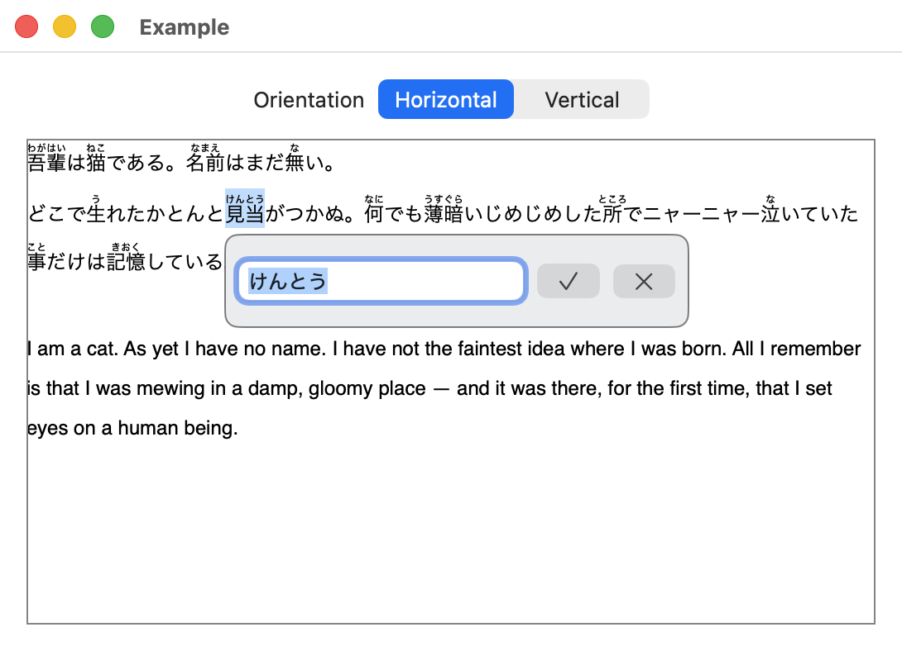
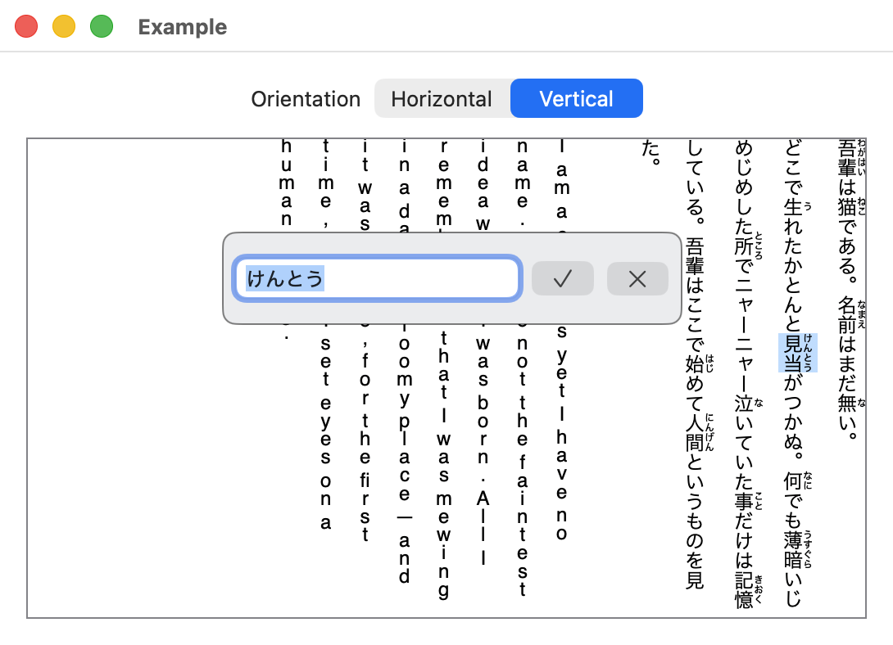
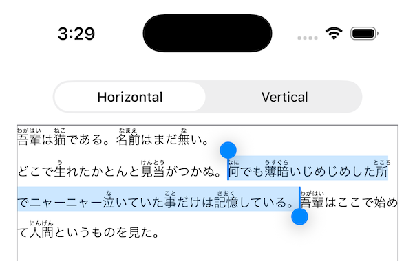
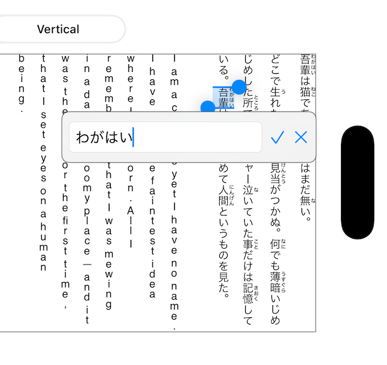

# Portico

A reusable **horizontal + vertical Japanese text component with ruby (furigana) editing**, built
directly on **Core Text** for macOS and iOS. Portico owns the hard parts — layout in both writing
modes, hit-testing, selection, caret, IME, clipboard, and the ruby model — and exposes them as a
SwiftUI view or a headless engine. It is **framework-first**: it provides the primitives and
geometry; *your* app supplies the editing UI.

This README is written as a reference for engineers building a Japanese text editor: it covers
both what the component does (the user's point of view) and the API you call to embed it (the
client app's point of view).

## Screenshots

The same document — Sōseki's *I Am a Cat* with furigana — laid out both ways on both platforms,
showing selection and the in-place ruby editor.

|  | Horizontal | Vertical |
|---|---|---|
| **macOS** |  |  |
| **iOS** |  |  |

## What you get

From the **user's** side:

- **Horizontal and vertical** Japanese layout (横書き / 縦書き), switchable at runtime.
- **Ruby (furigana)** rendered above (horizontal) or right of (vertical) its base.
- **縦中横 (tate-chū-yoko)** — automatic, no markup: two-digit numbers ("12") and
  half-width `!?`-family pairs render **upright in one column cell** in vertical text,
  with correct wrapping, selection, caret, and editing through the group. Pure layout
  rule re-derived from the text; nothing is persisted for the automatic cases.
- **縦中横 overrides** (0.6.0) — artist intent over the rule: force-combine any range
  ("123", "'26") or suppress an auto pair, via a persisted attribute + a
  state-dependent menu toggle (縦中横 / 縦中横を解除); serialized as `[[tcy:…]]` /
  `[[tcy-off:…]]` in the owned notation.
- **Outline / 縁取り (fuchi)** — whole-text rim behind the fill (manga lettering over
  artwork); ruby and 縦中横 groups are outlined too, at the same absolute rim width.
- **Line pitch control** — a uniform, ruby-reserving line pitch with a runtime multiplier.
- Native **selection** (drag, double-click/tap word-select, handles), **caret**, and
  **arrow-key / Shift-arrow** navigation that follows the writing mode.
- **IME** marked text and candidate placement on both platforms.
- **Clipboard** — cut / copy / paste / select-all; copy carries ruby, so it survives paste.
- In-place **ruby editing** — select text, invoke a menu action, set/edit/remove the reading.
- **Undo / redo** across every edit — typing, delete, paste, cut, ruby, inline conversion.
  **Model-scoped** when you own the engine: history survives view teardown. Portico vends the
  engine's `UndoManager` up the AppKit/UIKit responder chain (so it works from a custom `NSView`/`UIView`
  and your own Undo buttons); a **SwiftUI** app should also replace the default Edit ▸ Undo/Redo
  commands to drive the engine — SwiftUI's own Undo binds to a different manager (the
  [Example](Example/Example/ExampleApp.swift) shows the `FocusedValue` + `CommandGroup` wiring).

From the **integrator's** side:

- A SwiftUI **`PorticoView`** — `PorticoView(text:)` for a quick binding, or `PorticoView(engine:)`
  when you own the engine (model-scoped undo) — or the platform-neutral **`PorticoTextLayoutEngine`**
  to drive your own `NSView`/`UIView`.
- A plain-text **ruby notation** (`PorticoRuby`) for authoring and persistence.
- Geometry + a **menu seam** to build your own editing UI without reimplementing layout.
- A **headless rendering surface** for canvas/raster hosts: `drawText(in:)` (display-only,
  no editing chrome), `measuredSize(inlineExtent:)` (verified-fit content measurement),
  `inkBounds()` (glyph-ink extents incl. ruby overhang + outline) — the recipe is
  [HeadlessRendering.md](Docs/HeadlessRendering.md).
- **`typingAttributes`** (base attributes for empty documents) and **`focusesOnMount`**
  (programmatic editor mounts claim first responder) — the in-place-overlay integration
  surface driven by Portico's first production client.

## Requirements

macOS 13+ · iOS 16+ · Swift 6.2 toolchain.

## Installation

Swift Package Manager — add the dependency in `Package.swift`:

```swift
.package(url: "https://github.com/codelynx/Portico.git", from: "0.3.0")
```

Then `import Portico`.

## Concepts

Two layers, cleanly separated:

- **`PorticoTextLayoutEngine`** — platform-neutral, pure Core Text. Holds the `NSAttributedString`,
  the orientation, the selection/caret/marked state, and does all layout, hit-testing, drawing, and
  geometry. No UIKit/AppKit selection UI.
- **`PorticoView`** (SwiftUI) / **`PorticoTextView`** (`NSView` on macOS, `UIView`+`UITextInput`
  on iOS) — thin wrappers that connect the engine to the platform: events, IME, native selection
  UI, clipboard, and the menu seam.

**Annotation model.** The `NSAttributedString` IS the model: ruby (one contiguous base range +
one reading, stored as a `CTRubyAnnotation` attribute) and 縦中横 overrides (an identity-boxed
attribute) live as attributes over the base — never in the backing string, so string indices,
hit-testing, and selection are unaffected. The public interchange format is the **owned
notation** (`PorticoNotation`: `[[ruby:漢字|かんじ]]`, `[[tcy:123]]`, `[[tcy-off:12]]` — uniform
escaping, fail-safe parsing, one keyword per future annotation kind). Aozora `《》` remains a
**one-way import** (`PorticoNotation.parse(aozora:)`, and the paste boundary); nothing ever
serializes to it.

**Rendering ownership** differs per platform (this is the source of most platform-specific
behavior): macOS draws selection + caret itself; iOS lets `UITextInteraction` own them (handles,
loupe, edit menu). See [Platform parity](Docs/PlatformParity.md).

## Quick start

```swift
import SwiftUI
import Portico

struct ContentView: View {
    @State private var text = PorticoRuby.parse("吾輩《わがはい》は猫《ねこ》である。")
    @State private var orientation: PorticoLayoutOrientation = .vertical

    var body: some View {
        PorticoView(text: $text, orientation: orientation)
    }
}
```

## Using the API (client app's point of view)

### 1. Author & persist ruby

The owned notation (`PorticoNotation`, 0.6.0) is the persistence format — one namespaced span
grammar for every annotation kind:

| Command | Meaning |
|---------|---------|
| `[[ruby:漢字\|かんじ]]` | ruby (explicit base \| reading) |
| `[[tcy:123]]` | 縦中横 force-combine |
| `[[tcy-off:12]]` | 縦中横 suppress (un-combine an auto pair) |

```swift
let attributed = PorticoNotation.parse("[[ruby:吾輩|わがはい]]は[[ruby:猫|ねこ]]である。")
let notation   = PorticoNotation.serialize(attributed)  // parse(serialize(x)) is identity

// Apply base attributes (font/colour) to the whole string while attaching annotations:
let styled = PorticoNotation.parse("[[ruby:猫|ねこ]]", attributes: [.font: someFont])

// Aozora-notation text imports one-way (nothing ever serializes back to 《》):
let imported = PorticoNotation.parse(aozora: "吾輩《わがはい》は猫《ねこ》である。")
```

The four metacharacters `[ ] | \` are always backslash-escaped; `\x` reads as literal `x`.
Round-trip is guaranteed for **any** content — malformed markup fails safe as visible literal
text, never destroyed content and never a stray annotation. Automatic 縦中横 groups serialize
as plain text (only artist overrides carry commands). The legacy `PorticoRuby.parse`/`serialize`
(Aozora, ruby-only, no escaping) remain for import-side compatibility.

### 2. Render & switch orientation

Bind the text and flip `orientation` at runtime; the view re-lays out.

```swift
PorticoView(text: $text, orientation: isVertical ? .vertical : .horizontal)
```

### 3. Observe the selection

```swift
PorticoView(text: $text, orientation: orientation, selectedRange: $selectedRange)
// selectedRange: Binding<NSRange?> — nil when collapsed to a caret.
```

### 4. Build an in-place ruby editor

Set `onSelectionMenuAction` and Portico adds a **menu item** to the iOS edit menu and the macOS
right-click menu, handing your handler the selected range plus a popover **anchor rect** (top-left
view coordinates). You supply the reading UI; you write the change with **`engine.setRuby`** — one
**undoable** step. Own the engine (`PorticoView(engine:)`) so ruby edits are undoable and
model-scoped. Opt-out by default — no action, no menu item. For a macOS `Edit ▸ …` command, wire a
main-menu item to the view's `performSelectionMenuAction(_:)` (the
[Example](Example/Example/ExampleApp.swift) does this with a `⇧⌘R` shortcut).

For **multiple items or state-dependent titles**, pass `selectionMenuActions:` — a provider
called at menu-open with the current selection. The Example uses it to add the 縦中横 toggle
beside Ruby…, with its title read from `engine.tateChuYokoToggle(for:)`:

```swift
PorticoView(engine: engine, selectionMenuActions: { range in
    [
        PorticoSelectionMenuAction(title: "Ruby…") { range, anchor in /* popover */ },
        PorticoSelectionMenuAction(
            title: engine.tateChuYokoToggle(for: range) == .release ? "縦中横を解除" : "縦中横"
        ) { range, _ in engine.performTateChuYokoToggle(for: range) },
    ]
})
```

```swift
struct RubyEditor: View {
    // Own the engine → ruby edits are undoable and model-scoped.
    @State private var engine = PorticoTextLayoutEngine(
        attributedString: PorticoRuby.parse("吾輩《わがはい》は猫《ねこ》である。"))
    @State private var editing: (range: NSRange, anchor: CGRect)?
    @State private var reading = ""

    var body: some View {
        PorticoView(
            engine: engine,
            orientation: .vertical,
            onSelectionMenuAction: PorticoSelectionMenuAction(title: "Ruby…") { range, anchor in
                // Prefill only when the selection is exactly an existing group's base (an edit);
                // otherwise start empty (add / replace over the selection).
                let group = PorticoRuby.rubyGroup(at: range.location, in: engine.attributedString)
                reading = (group?.base == range ? group?.reading : nil) ?? ""
                editing = (range, anchor)
            }
        )
        .overlay(alignment: .topLeading) {
            if let edit = editing {
                TextField("reading", text: $reading)     // position at edit.anchor in your layout
                    .onSubmit {
                        // one undoable step (empty reading removes the ruby)
                        engine.setRuby(reading.isEmpty ? nil : reading, for: edit.range)
                        editing = nil
                    }
            }
        }
    }
}
```

Supporting queries for editing UI:

```swift
PorticoRuby.rubyGroup(at: index, in: attributed)     // (base, reading)? at a character
PorticoRuby.rubyGroups(in: range, of: attributed)    // groups intersecting a range
PorticoRuby.setRuby(_:for:in:)                        // add / edit / remove (nil, empty, or whitespace-only removes)
```

Inline authoring while typing — entering `漢字《かんじ》` converting to a ruby group on the
closing `》` — is **opt-in since 0.6.0** (`engine.importsAozoraRubyWhileTyping = true`;
committed text only, never inside IME composition). Off by default: `《》` is legitimate title
punctuation, and Aozora import belongs to explicit boundaries (paste always imports it).

### 5. Clipboard

Cut / Copy / Paste / Select-All are built in on both platforms (menu items and ⌘/hardware
shortcuts). Copy serializes the selection to the owned notation and Paste parses it, so **ruby
and 縦中横 overrides survive copy/paste** within Portico; plain text copies/pastes as-is. Paste
also imports Aozora `《》` from external text (one-way — copy never emits it).

### 6. Drive the engine directly (headless or custom view)

For a fully custom view, or offscreen layout/measurement, use the engine without SwiftUI:

```swift
let engine = PorticoTextLayoutEngine(
    attributedString: PorticoRuby.parse("吾輩《わがはい》は猫《ねこ》である"),
    orientation: .vertical,
    bounds: CGSize(width: 400, height: 600)
)

// In your draw path:
engine.update(bounds: view.bounds.size)
engine.draw(in: cgContext)

// Interaction:
let i     = engine.stringIndex(for: point)          // hit-test → character index
let rects = engine.selectionRects(for: range)       // one rect per line/column the range spans
let caret = engine.caretRect(for: engine.cursorIndex)
engine.setSelectedRange(range)                       // set caret/selection
engine.moveCursor(direction: .down, modifySelection: true)   // orientation-aware nav
let anchor = engine.anchorRectForSelection()         // first-segment popover anchor (top-left)
```

Observe changes with `engine.textDidChange` / `engine.selectionDidChange`.

## Undo & redo — integration tips

Undo is the part most likely to surprise you when embedding a custom text engine, so these are the
lessons worth stealing. They're framework-neutral: they apply to any app that hosts Portico, and the
same shapes recur any time you drive undo from a model object rather than a stock text field. The
[Example](Example/Example/) encodes all of them.

**1. Own the engine for undo that outlives the view.** `PorticoView(text:)` creates the engine
internally, so its history dies when SwiftUI tears the view down (navigation, tab switch, cell
reuse). For document-scoped undo, hold a `PorticoTextLayoutEngine` yourself and pass it in — the
undo stack lives on the engine, so it survives as long as you retain it:

```swift
@State private var engine = PorticoTextLayoutEngine(attributedString: PorticoRuby.parse(text))
PorticoView(engine: engine, orientation: orientation, onSelectionMenuAction: …)
```

(In a real app hold the engine in a view model / ancestor that shares the document's lifetime, not a
leaf `@State` whose view identity may be torn down — a structural identity change, navigation pop,
`.id(…)` change, or cell reuse discards `@State` and with it the stack.) To make Portico's edits
part of a document app's *own* undo instead of a private stack, hand the engine your document's
manager: `PorticoTextLayoutEngine(attributedString:…, undoManager: document.undoManager)`.

**2. Edit through engine commands, not by replacing the document.** Undoable edits go through the
engine — typing/delete via the view, ruby via `engine.setRuby(reading, for: range)`. Replacing the
whole string (`engine.update(attributedString:)`) is treated as a **document reset** and *clears*
Portico's undo history for that engine — deliberately, since loading a new document shouldn't be
undoable. (The clear is target-scoped, so an injected document manager keeps its other actions; and
re-assigning identical content is a no-op that leaves the stack intact.) So apply ruby with
`setRuby`, never by rebuilding and re-assigning the attributed string.

**3. In SwiftUI, wire ⌘Z / Edit ▸ Undo yourself.** Portico vends the engine's `UndoManager` up the
**AppKit/UIKit responder chain**, so a plain `NSView`/`UIView` host gets undo for free. (Your own
Undo buttons work because they call `engine.undoManager` directly, not through the chain.) But
SwiftUI's *default* Edit ▸ Undo / ⌘Z bind to `@Environment(\.undoManager)`, a different manager your
edits never touch, so they silently do nothing. Replace those commands and bridge the focused engine
up to them:

```swift
// App — replace the stock Undo/Redo with commands that drive the engine:
@FocusedValue(\.porticoEngine) private var engine: PorticoTextLayoutEngine?

.commands {
    CommandGroup(replacing: .undoRedo) {
        Button("Undo") { if let e = engine, e.markedRange == nil { e.undoManager.undo() } }
            .keyboardShortcut("z", modifiers: .command)
            .disabled(engine == nil || engine?.markedRange != nil)   // disabled while composing, too
        Button("Redo") { if let e = engine, e.markedRange == nil { e.undoManager.redo() } }
            .keyboardShortcut("z", modifiers: [.command, .shift])
            .disabled(engine == nil || engine?.markedRange != nil)
    }
}
// View — publish the engine to the command via a FocusedValues key you define (see the Example):
.focusedSceneValue(\.porticoEngine, engine)
```

**4. Reflect `canUndo`/`canRedo` off the *settled* notifications.** The engine isn't `Observable`
(by design — it mutates high-frequency state per keystroke), so drive your Undo/Redo buttons'
enabled state from the `UndoManager`'s notifications. Use the ones that fire **after** the stack
settles — `NSUndoManagerDidCloseUndoGroup` / `DidUndoChange` / `DidRedoChange`. A naïve
`NSUndoManagerCheckpoint` fires at group-close *before* the step lands, so `canUndo` reads a step
stale — the classic "Undo greyed out right after an edit":

```swift
// requires `import Combine`
.onReceive(Publishers.MergeMany([
    .NSUndoManagerDidCloseUndoGroup, .NSUndoManagerDidUndoChange, .NSUndoManagerDidRedoChange
].map { NotificationCenter.default.publisher(for: $0, object: engine.undoManager) })) { _ in
    canUndo = engine.undoManager.canUndo
    canRedo = engine.undoManager.canRedo
}
```

A document reset (`update(attributedString:)`) empties the stack *without* posting these
notifications, so refresh the same `canUndo`/`canRedo` from that code path too, or the buttons stay
stale-enabled.

**5. Don't undo during IME composition.** Portico blocks its own entry points (Edit menu, ⌘Z,
shake) while marked text is active by vending `nil` from the view's `undoManager` — undoing
mid-composition would desync the IME. If you add your *own* undo controls, guard them the same way:
`guard engine.markedRange == nil`.

**6. The engine runs on the main actor.** `PorticoTextLayoutEngine` is `@MainActor` (Foundation's
`UndoManager` is), so touch it — and the manager — from the main actor only. Standard for UI state;
noted because the engine is otherwise headless and might read as thread-agnostic.

## Platform behavior

Input, selection, ruby editing, and clipboard are at parity across macOS and iOS. The remaining
differences are iOS **vertical-text** rendering details rooted in UIKit limits (native selection
handles/loupe in vertical). Full matrix and rationale: [Platform parity](Docs/PlatformParity.md).

## Status & limitations

Layout, rendering, selection, IME, ruby (parse / serialize / edit), 縦中横, outline,
headless measurement/rendering, navigation, clipboard, and undo/redo are in place on both
platforms. Consciously deferred:

- **Mono-/jukugo-ruby** (per-character readings) — v1 is group-ruby.
- **Public ruby styling knobs** (alignment / overhang / scale) — v1 uses sane fixed defaults.
- iOS **vertical** native selection handles/loupe.
- **縦中横 `rotate`** (glyph-form control for lone characters) — combine/suppress shipped in
  0.6.0; rotate is a different mechanism with no menu use-case yet.
- The **legacy Aozora path** (`PorticoRuby.parse`/`serialize`) still has no escaping — by
  design, it's import-only; the owned notation escapes everything.

## Documentation

- [Ruby support](Docs/RubySupport.md) — notation, parsing, rendering, and the clipboard round-trip.
- [Ruby editing design](Docs/RubyEditing-Design.md) — the editing model and the selection-menu seam.
- [Platform parity](Docs/PlatformParity.md) — iOS ↔ macOS behavior and known limits.
- [Manga-lettering extensions](Docs/MangaLettering-Extensions-Plan.md) — the headless/outline/
  measurement surface, plan + as-built notes.
- [Headless rendering](Docs/HeadlessRendering.md) — the raster-host recipe.
- [Changelog](CHANGELOG.md).

A runnable demo is in [`Example/`](Example/): horizontal ⇄ vertical toggle, ruby rendering,
the select → menu → popover editor, and the 縦中横 toggle (select "158" in vertical → 縦中横).

## License

Portico is released under the **MIT License** — see [LICENSE](LICENSE).
